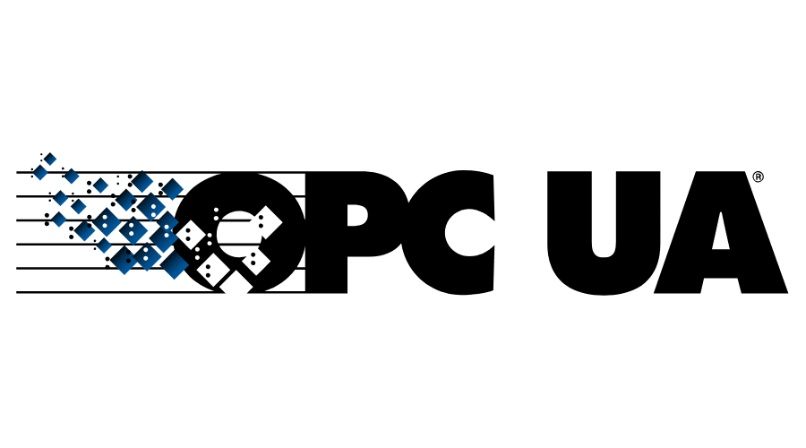

 

  

  <h3 align="center">NF OPC Integration</h3>

  

    A Normal Framework plugin that uses OPC UA protocol to import objects from an OPC Server into the Normal Framework. The integration leverages the <a href="https://github.com/node-opcua/node-opcua">node-opcua</a> npm package to connect to the OPC Server. 
  

<!-- ABOUT THE PROJECT -->
### Getting Started

Install the application using git. Then configure it according to your needs.

### Configuration

`endpoint` (required) - the OPC Server URL to connect to. E.g. `opc.tcp://opcuademo.sterfive.com:26543`

`targetPaths` (optional) - comma delimited paths to import. If not defined, all objects on the server will be imported. E.g. `RootFolder/Objects/DeviceSet/CoffeeMachine,RootFolder/Objects/Boiler#1`

### Authentication

The OPCUA Client support various OPC Authentication Schemes. Pass the appropriate authentication configuration when creating the client.

![Auth Screenshot][auth-screenshot]

See the [client options](https://node-opcua.github.io/api_doc/2.0.0/interfaces/opcuaclientoptions.html) documenation for available options.

### Viewing Data

Data is imported to the `hpl:opc:1` layer. This layer utilized the NF path type feature to organize the data a hierachy which follows the OPC structure.

[auth-screenshot]: images/auth-screenshot.png