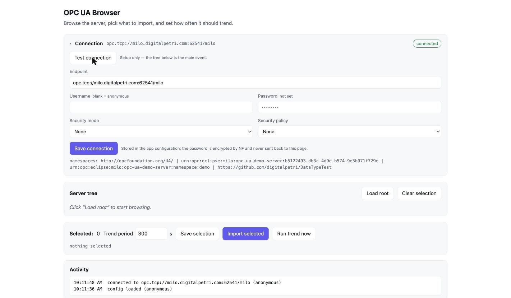
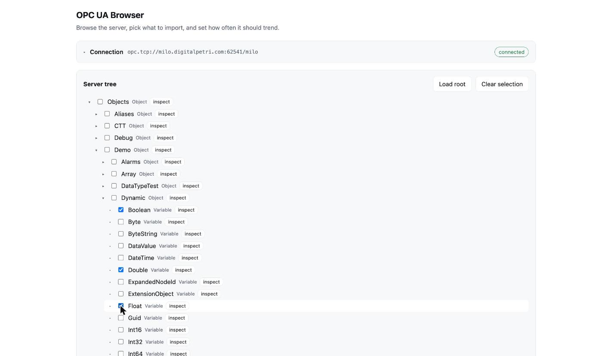
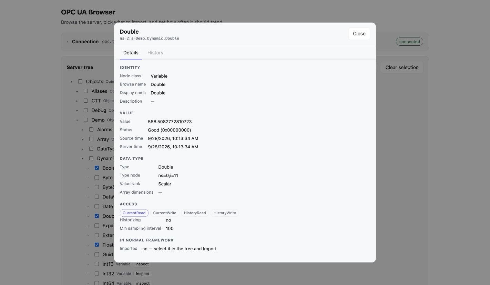

 

  

  <h3 align="center">NF OPC Integration</h3>

  

    A Normal Framework app that browses an OPC UA server, imports the nodes you
    select as points, and polls them on a schedule. Built on
    <a href="https://github.com/node-opcua/node-opcua">node-opcua</a>.
  

## How it works

Discovery and trending are separate, and only discovery is expensive.

| Hook | Mode | Bound to | Job |
|---|---|---|---|
| `discover` | on request | — | RPC endpoint for the browser UI |
| `import-selected` | on request | — | create points for the nodes you ticked |
| `trend-data` | scheduled | a point query on `period` | poll values |

Each point stores its OPC nodeId in **`protocol_id`**, so `trend-data` reads
every value with a single batched `session.read()` and never browses. Browsing
happens only when you open the UI or run an import.

`trend-data` is bound to a point query for `period > 0`, so it polls exactly the
points you marked for trending in the Object Explorer — set a period on a point
and it starts, clear it and it stops. No code change, no redeploy.

## Install

Install the app from this repository's GitHub URL, then open **Configure**.

| Option | Notes |
|---|---|
| `endpoint` | `opc.tcp://host:4840/path` |
| `username` | leave blank to connect anonymously |
| `password` | stored encrypted by NF; never written to app files or logs |
| `securityMode` | `None`, `Sign`, or `SignAndEncrypt` |
| `securityPolicy` | `None`, `Basic256Sha256`, `Basic256`, `Basic128Rsa15` |

Credentials belong here, not in source. You can also edit them from the app's
own UI, which writes to the same config.

## Browsing and importing

Open the app's UI (**View** on the app tile). The **Connection** panel is
collapsed by default; expand it to set the endpoint or hit **Test connection**.

1. **Load root** and expand the tree. Only Objects expand — Variables are the
   importable leaves, and a Variable's own children are its metadata, not
   points, so they are not shown.
2. Tick what you want. A selection can be a whole subtree or a single node.
3. Set a **trend period** (seconds) and **Import selected**.

Every node has an **inspect** button showing all of its OPC attributes: node
class, data type, value with its status and both timestamps, the decoded
`AccessLevel` bits, `Historizing`, and its properties. If the node exposes
history, the inspector also plots it and reports how far back the archive goes.

## Trending and data quality

A non-Good status does **not** discard the reading. `statusCode.isGood()` is
false for Uncertain as well as Bad, so treating it as failure silently freezes a
point at its last good value while every run still reports success. Instead the
value is trended and the status is recorded on the point's error stream —
`/api/v1/point/data` takes an `errors` array beside `values`, and the status then
shows up as the point's `latestError`.

Numeric values are stored as `double`. `real` is float32 and loses precision on
int32, and node-opcua hands back 64-bit integers as `[high, low]` word pairs,
which have to be recombined before they mean anything.

## Historical Data Access

Servers that expose an HDA namespace are browsable like any other branch. Those
nodes are typically `HistoryRead` **only** — reading their live value returns
`BadNotReadable`, which is correct, not a fault — so give them a period of 0 and
read them through the inspector rather than polling them.

HDA items carry their metadata as properties whose BrowseName is the numeric
classic-OPC attribute id (`2147483650` is `0x02` Description, `2147483651` is
`0x03` Engineering Units). The readable label lives on the property node's
DisplayName. On import, Description and Engineering Units populate the point's
`description` and `units_display`, and every other attribute the server
publishes is carried as an `opc_*` attr.

Some servers only answer the first read of an attribute item and return
`BadWaitingForInitialData` to later ones. Treat these values as read-once:
they are captured at import and persisted on the point.

## Layer

Points are written to `hpl:opc:1`, which uses the NF PATH type so the Object
Explorer mirrors the OPC hierarchy. Change `layer.name` in `app.json` (and
`LAYER` in `helpers.js`, and the `trend-data` hook's point query) if you need a
second instance to write somewhere else.

## Test server

`test/` contains a self-contained Python OPC UA server with synthetic data
across every supported type. See [test/README.md](test/README.md).

## Notes

A long-lived session is reused across hook invocations and closed on shutdown.
Some servers — DeltaV's HDA interface among them — have very few client slots
and react badly to session churn, to the point of serving an empty item list
while still reporting that they are running. If a populated branch suddenly
browses as empty, leave it alone for a minute or two before assuming an outage,
and check the server's own `ServerStatus`.
